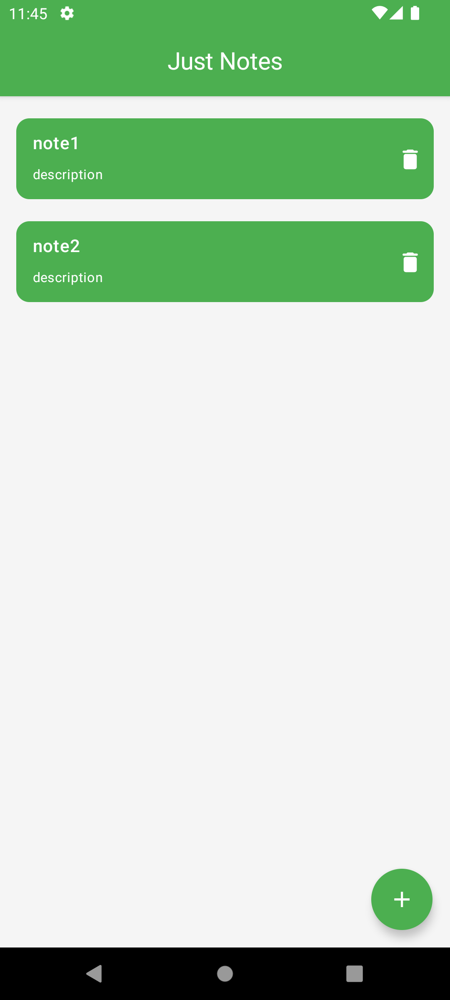
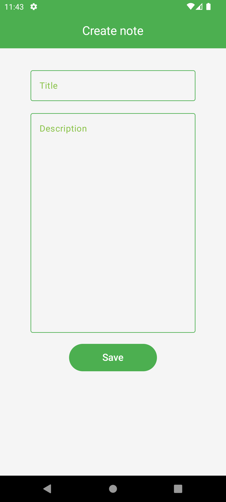

# JustNotes

## Screenshots

<p align="center">
  
  
  
</p>

## Description
JustNotes is a streamlined and user-friendly Android application designed not only to facilitate the creation, updating,
and deletion of notes but also to serve as an educational resource for new Android developers. This project is tailored
to help developers learn how to code properly and implement robust Android app architecture, while offering users an 
effective tool for managing their daily tasks and ideas.

The codebase is structured to demonstrate best practices in Android development, including clean architecture, dependency injection, and modern UI design using Jetpack Compose.

**This is not the final version of the project. Its code will be refactored and improved, new features will be added.**

## Key Features
1. **Display all notes**: Users can view all created notes on the home screen. They can edit or delete a note by tapping on it.
2. **Create Notes**: Users can quickly create new notes with a simple interface.
3. **Update Notes**: Existing notes can be easily edited to reflect new information or changes.
4. **Delete Notes**: Users can delete notes that are no longer needed, keeping their notes organized and clutter-free.

## Technologies Used
- Kotlin, Kotlin Coroutines
- Jetpack Compose
- Room local database
- Dagger Hilt

## Learning Objectives
- Understand and implement MVVM/MVI architecture with Clean Architecture principles.
- Learn how to use Kotlin effectively in Android development.
- Explore Jetpack Compose for building modern, responsive UI components.
- Gain hands-on experience with dependency injection using Dagger Hilt.
- Practice writing clean, maintainable, and testable code.

## Getting Started
To get a local copy up and running, follow these simple steps:

### Prerequisites
- Android Studio installed on your machine.
- An Android device or emulator for testing.

### Installation
1. Clone the repository:
   ```bash
   git clone https://gitlab.com/just-notes/just-notes.git
2. Open the project in Android Studio.
3. Build and run the project on an Android device or emulator.